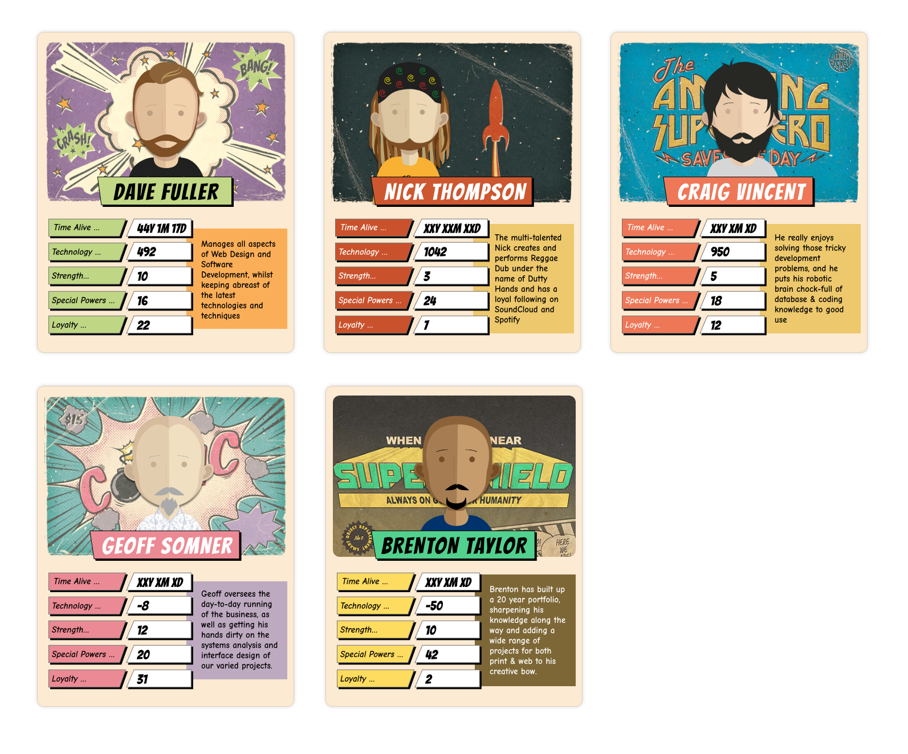

## Front-End Interview Test

This is a simple front-end and PHP code challenge created to serve two purposes:

1. Show off your skills
2. Give us a better understanding of your skills

## The Task

The programming challenge exists in 2 parts:

- Part A: HTML + CSS
- Part B: PHP + Javascript

### PART A: HTML + CSS

- Create a layout based on the given screen (front-end_visual_screen.png, front-end_visual_screen.xd).
- Style the layout consistently and beautifully, adhering as closely to the design as possible.
- **NOTE:** You are free to use any preprocessor you wish or write raw CSS. Think about utility-based CSS classes to create re-usable code.

### PART B: PHP + Javascript

- Use the supplied serialised PHP data (front-end_data.txt) to display the details of each card, including:
  - Name 
  - Description
  - Time Alive
  - Technology
  - Strength
  - Special Powers
  - Loyalty
- Format the DOB from the data to determine how long they have been alive using days, weeks, months and years.
- Retrieve the formatted data using JavaScript
- Display the formatted data in the HTML + CSS layout created in step A, sticking to the design, placing data where it fits.
- **NOTE:** You are free to use any framework you wish or do it VanillaJS style

## Questions

- What libraries did you add to the frontend? What are they used for?
- How long did you spend completing the test?
- If you had more time, what further improvements or new features would you add?
- Which parts are you most proud of? And why?
- Which parts did you spend the most time with? What did you find most difficult?
- How did you find the test overall? Did you have any issues or have difficulties completing?If you have any suggestions on how we can improve the test, we'd love to hear them.

## Additional Instructions

- Download the repository

- After you're done, send us your code
- Leave comments on our repository where you were not sure how to properly proceed
- Implementations without a README will be automatically rejected
- No pull requests
- ES6 and above
- PHP 7.4 and above

## Bonus Points

- Clean and commented code!
- Knowledge of application flow
- Knowledge of modern best practices/coding patterns
- Demonstration of good state management
- Usage of frameworks/supersets
- Pixel perfection
- Usage of utility-driven styles
- The clean, organised website directory structure
- Basic knowledge of DevOps
- Knowledge of Docker
